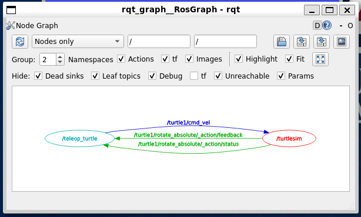
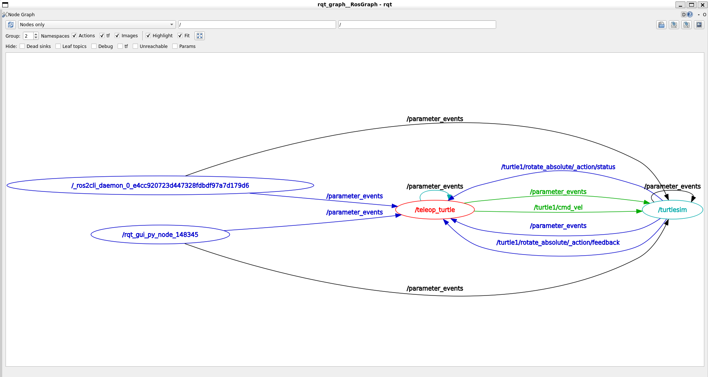

# The ROS 2 Graph

The ROS graph is a network of ROS 2 elements processing data together at the same time.
The elements in the graph are called `nodes`, and they communicate with each other using `topics`, `services`, and `actions`.


## Nodes

A robotic system is composed of many nodes working together.
Each node should be responsible for a single, modular purpose.
In ROS, each node can send and receive data from other nodes via topics, services, or actions.
For instance, in the talker and listener example, the talker node is responsible for publishing messages, while the listener node is responsible for receiving those messages.

### List the Running Nodes

In large robotic systems, there can be many nodes running at the same time.
To list the nodes that are currently running, you can use the following command in a new terminal window:

```bash
ros2 node list
```

For example, to list the nodes running after starting the `turtlesim` node, you would see the following output:

```bash
/turtlesim
```

This output indicates that only the `turtlesim` node is currently running.
If you start another node, for instance, the `turtle_teleop_key` node by running the following command in a new terminal window:

```bash
ros2 run turtlesim turtle_teleop_key
```

You can then list the running nodes again using the `ros2 node list` command, and you would see the following output:

```bash
/turtlesim
/teleop_turtle
```

This output indicates that both the `turtlesim` and `teleop_turtle` nodes are currently running.

### Remapping a Node

Remapping allows you to reassign default node properties, like node name, topic names, service names, etc., to custom values.
For example, in the [previous section](#moving-turtle2), you remapped the `cmd_vel` topic of the node `turtle1` (i.e., `/turtle1/cmd_vel`) topic to control `turtle2`.

Now, let's create a new `turtlesim` with a custom name `my_turtle` by running the following command:

```bash
ros2 run turtlesim turtlesim_node --ros-args --remap __node:=my_turtle
```

This command creates a new `turtlesim` node with the name `my_turtle`.
Since `ros2 run` was called, also a new TurtleSim window will open.
If you list the running nodes using the `ros2 node list` command, you would see the following output:

```bash
/my_turtle
/teleop_turtle
/turtlesim
```

### Accessing Node Information

Once you have the name of a node, you can access information about that node using the following command:

```bash
ros2 node info <node_name>
```

For example, to get information about the `my_turtle` node, you would run the following command:

```bash
ros2 node info /my_turtle
```

The output will look similar to the following:

```bash
/my_turtle
  Subscribers:
    /parameter_events: rcl_interfaces/msg/ParameterEvent
    /turtle1/cmd_vel: geometry_msgs/msg/Twist
  Publishers:
    /parameter_events: rcl_interfaces/msg/ParameterEvent
    /rosout: rcl_interfaces/msg/Log
    /turtle1/color_sensor: turtlesim/msg/Color
    /turtle1/pose: turtlesim/msg/Pose
  Service Servers:
    /clear: std_srvs/srv/Empty
    /kill: turtlesim/srv/Kill
    /my_turtle/describe_parameters: rcl_interfaces/srv/DescribeParameters
    /my_turtle/get_parameter_types: rcl_interfaces/srv/GetParameterTypes
    /my_turtle/get_parameters: rcl_interfaces/srv/GetParameters
    /my_turtle/get_type_description: type_description_interfaces/srv/GetTypeDescription
    /my_turtle/list_parameters: rcl_interfaces/srv/ListParameters
    /my_turtle/set_parameters: rcl_interfaces/srv/SetParameters
    /my_turtle/set_parameters_atomically: rcl_interfaces/srv/SetParametersAtomically
    /reset: std_srvs/srv/Empty
    /spawn: turtlesim/srv/Spawn
    /turtle1/set_pen: turtlesim/srv/SetPen
    /turtle1/teleport_absolute: turtlesim/srv/TeleportAbsolute
    /turtle1/teleport_relative: turtlesim/srv/TeleportRelative
  Service Clients:

  Action Servers:
    /turtle1/rotate_absolute: turtlesim/action/RotateAbsolute
  Action Clients:

```

This output provides information about the subscribers, publishers, services, and actions associated with the `my_turtle` node.
Note that services and actions are composed of a server and a client.
The client sends a request to the server, which processes the request, executes the service or action, and sends a response back to the client.
Specifically,

- `Subscribers` are topics that the `my_turtle` node is listening to.
- `Publishers` are topics that the `my_turtle` node is publishing to.
- `Service Servers` are nodes that serve services to the `my_turtle` node.
- `Service Clients` are nodes that request services from the `my_turtle` node.
- `Action Servers` are nodes that serve actions to the `my_turtle` node.
- `Action Clients` are nodes that request actions from the `my_turtle` node.

It is quite interesting to gather the same information for the `teleop_turtle` node.
To do so, run the following command:

```bash
ros2 node info /teleop_turtle
```

The output will look similar to the following:

```bash
/teleop_turtle
  Subscribers:
    /parameter_events: rcl_interfaces/msg/ParameterEvent
  Publishers:
    /parameter_events: rcl_interfaces/msg/ParameterEvent
    /rosout: rcl_interfaces/msg/Log
    /turtle1/cmd_vel: geometry_msgs/msg/Twist
  Service Servers:
    /teleop_turtle/describe_parameters: rcl_interfaces/srv/DescribeParameters
    /teleop_turtle/get_parameter_types: rcl_interfaces/srv/GetParameterTypes
    /teleop_turtle/get_parameters: rcl_interfaces/srv/GetParameters
    /teleop_turtle/get_type_description: type_description_interfaces/srv/GetTypeDescription
    /teleop_turtle/list_parameters: rcl_interfaces/srv/ListParameters
    /teleop_turtle/set_parameters: rcl_interfaces/srv/SetParameters
    /teleop_turtle/set_parameters_atomically: rcl_interfaces/srv/SetParametersAtomically
  Service Clients:

  Action Servers:

  Action Clients:
    /turtle1/rotate_absolute: turtlesim/action/RotateAbsolute
```

It is worth noting that the `teleop_turtle` node publishes to the `/turtle1/cmd_vel` topic, which is the topic that controls the turtle's movement, and the `my_turtle` and `turtle1` nodes subscribe to this topic.

## Topics

ROS 2 breaks complex systems down into many modular nodes.
Topics are a vital element of the ROS graph that act as a bus for nodes to exchange messages.


A topic can be one-to-one, one-to-many, many-to-one, or many-to-many.
In general, a node publishes messages to several topics and simultaneously subscribes to messages from any number of topics.


### Launch the `turtlesim` Package

To demonstrate the concept of topics, let's take again the example of the `turtlesim` package.
If you have any `turtlesim` nodes running, stop them by pressing `Ctrl + C` in the terminal windows where they were started.

Now, start the `turtlesim_node` and `turtle_teleop_key` nodes by running the following commands in two separate terminal windows:

```bash
ros2 run turtlesim turtlesim_node
```

```bash
ros2 run turtlesim turtle_teleop_key
```

### RQT Graph

RQT provides a graphical interface for visualizing the ROS graph.
This is particularly useful to visualize the changing nodes and topics in a complex robotic system.

To start the RQT Graph, open a new terminal window and run the following command:

```bash
rqt_graph
```

The RQT Graph window will open, displaying the nodes and topics in the ROS graph.
If nothing is displayed, you may need to refresh the graph by clicking the `Refresh` icon in the top left corner of the window.



The RQT Graph window shows the nodes as ellipses.
The nodes are connected by arrows, which represent the topics.
Each arrow points from the publisher node to the subscriber node.

In the `turtlesim` example, you will see the `/teleop_turtle` node publishing to the `/turtle1/cmd_vel` topic, and the `/turtlesim` node subscribing to the `/turtle1/cmd_vel` topic.

### List the Active Topics

To list the topics that are currently active, you can use the following command in a new terminal window:

```bash
ros2 topic list -t
```

The `-t` flag is optional and displays the type of each topic between parentheses.
In the `turtlesim` example, you would see the following output:

```bash
/parameter_events [rcl_interfaces/msg/ParameterEvent]
/rosout [rcl_interfaces/msg/Log]
/turtle1/cmd_vel [geometry_msgs/msg/Twist]
/turtle1/color_sensor [turtlesim/msg/Color]
/turtle1/pose [turtlesim/msg/Pose]
```

It is worth noting that not all topics are displayed in the RQT Graph.
For instance, the `/parameter_events` and `/rosout` topics are not displayed in the RQT Graph.
This is because the RQT Graph hides some topics by default.
To unhide these topics, uncheck the boxes next to `Hide` button in the RQT Graph window.



For beginners, it is recommended to keep the default settings and only unhide topics when necessary.

### Topic Data

To monitor the data being published to a topic, you can use the following command in a new terminal window:

```bash
ros2 topic echo <topic_name>
```

For example, to inspect the data being published to the `/turtle1/cmd_vel` topic, you would run the following command:

```bash
ros2 topic echo /turtle1/cmd_vel
```

If you try to operate the `turtle_teleop_key` node, you will see the data being published to the `/turtle1/cmd_vel` topic in the terminal window where the `ros2 topic echo` command was run.
The output will look similar to the following:

```bash
linear:
  x: 2.0
  y: 0.0
  z: 0.0
angular:
  x: 0.0
  y: 0.0
  z: 0.0
---
```

### Topic Information

To get more information about a topic, you can use the following command in a new terminal window:

```bash
ros2 topic info <topic_name>
```

For example, to get information about the `/turtle1/cmd_vel` topic, you would run the following command:

```bash
ros2 topic info /turtle1/cmd_vel
```

The output will look similar to the following:

```bash
Type: geometry_msgs/msg/Twist
Publisher count: 1
Subscription count: 1
```

### Topic Interface

The last output indicates that the `/turtle1/cmd_vel` topic is of type `geometry_msgs/msg/Twist`.
This means that in the package `geometry_msgs` there is a message `msg` called `Twist` that is used to publish data to the `/turtle1/cmd_vel` topic.
We can have a look at the interface of the `Twist` message by running the following command:

```bash
ros2 interface show geometry_msgs/msg/Twist
```

The output will look similar to the following:

```bash
# This expresses velocity in free space broken into its linear and angular parts.

Vector3  linear
        float64 x
        float64 y
        float64 z
Vector3  angular
        float64 x
        float64 y
        float64 z
```

Thus, a `Twist` message consists of two `Vector3` messages: `linear` and `angular`, each with three `float64` values: `x`, `y`, and `z`.
The `linear` part of the message expresses the linear velocity of the turtle, while the `angular` part expresses the angular velocity.
This is the interface that the `/turtle1/cmd_vel` topic expects when publishing data.

### Publishing Data to a Topic

Now that we know the interface of the `/turtle1/cmd_vel` topic, we can publish data to this topic directly from the terminal.
To publish data to a topic, you can use the following command in a new terminal window:

```bash
ros2 topic pub <topic_name> <message_type> '<message_data>'
```

For example, to publish data to the `/turtle1/cmd_vel` topic, you would run the following command:

```bash
ros2 topic pub /turtle1/cmd_vel geometry_msgs/msg/Twist "{linear: {x: 1.0, y: 0.0, z: 0.0}, angular: {x: 0.0, y: 0.0, z: 0.0}}"
```

This command will make the turtle move forward with a linear velocity of `1.0` and not rotate, as the angular velocity is zero, resulting in a straight line movement.
With no command-line arguments, the command publishes the message in a steady loop with frequency of 1 Hz.
To stop the loop, press `Ctrl + C`.

The frequency of the loop can be changed by providing the `--rate` flag followed by the desired frequency in Hz.
For example, to publish the message at a frequency of 0.5 Hz, you would run the following command:

```bash
ros2 topic pub /turtle1/cmd_vel geometry_msgs/msg/Twist "{linear: {x: 1.0, y: 0.0, z: 0.0}, angular: {x: 0.0, y: 0.0, z: 0.0}}" --rate 0.5
```

To inspect the frequency at which the message is being published, you can use the `ros2 topic hz` command.
For example, to check the frequency of the `/turtle1/cmd_vel` topic, you would run the following command in a new terminal window:

```bash
ros2 topic hz /turtle1/cmd_vel
```

To publish data to a topic only once, you can provide the `--once` flag as follows:

```bash
ros2 topic pub /turtle1/cmd_vel geometry_msgs/msg/Twist "{linear: {x: 1.0, y: 0.0, z: 0.0}, angular: {x: 0.0, y: 0.0, z: 0.0}}" --once
```

### Clean up

At this point you may have several nodes running over multiple terminal windows.
To stop all the nodes, press `Ctrl + C` in each terminal window.
