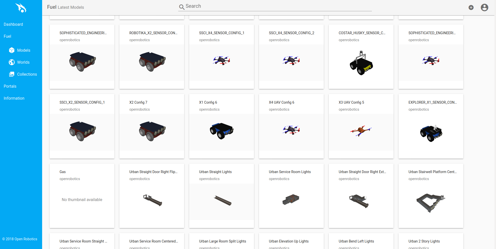
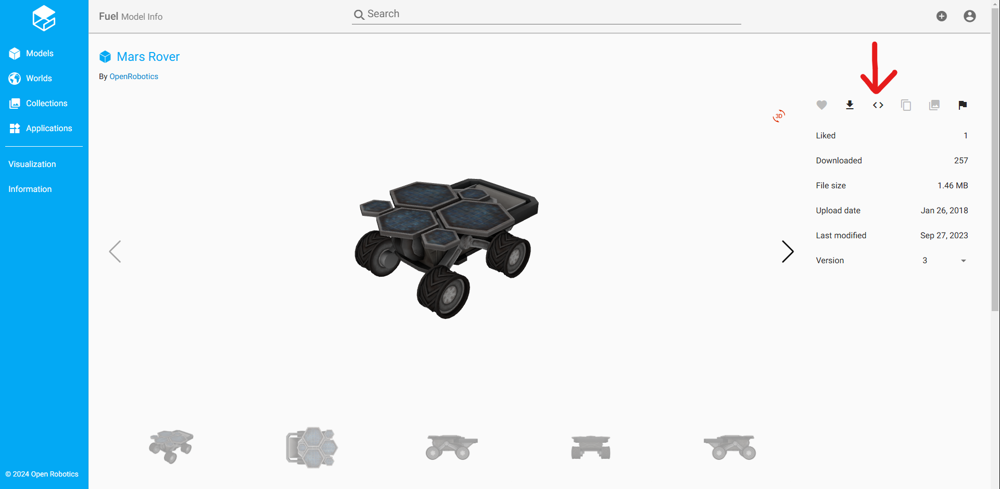
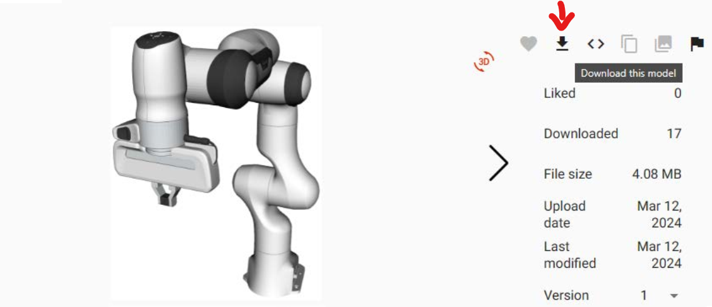
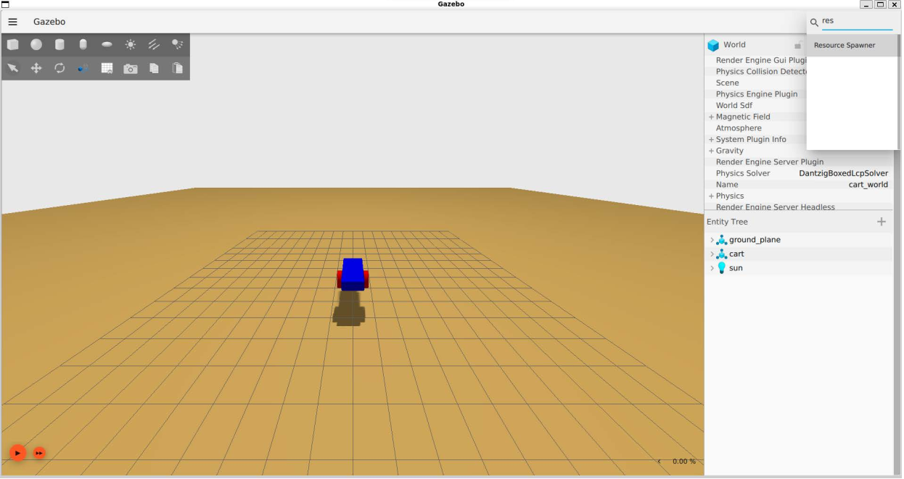

# Spawn an Imported URDF Model in Gazebo

There are many robot models available online in URDF format, so often it is more convenient to import an existing URDF model into Gazebo rather than creating a new model from scratch.
A popular repository for URDF models is the [Ignition Fuel](https://app.gazebosim.org/fuel/models) website.



## Import via SDF Snippet

The fastest way to import an URDF model into Gazebo is to copy the URDF model's SDF snippet into an SDF file.
This can be done by clicking on the `<>` icon on the Ignition Fuel website, as shown in the image below:



The SDF snippet looks something like this:

```xml
<include>
    <uri>
        https://fuel.gazebosim.org/1.0/OpenRobotics/models/Mars Rover
    </uri>
</include>
```

This SDF snippet can be copied into an SDF file as an additional model.
Since the `<include>` tag is equivalent to the `<model>` tag, additional features can be added to the model, such as links, joints, etc.
For instance, the following lines add a Mars Rover model at a specific pose:

```xml
<sdf version="1.8">
    <world name="world">
        <model name="some_model">
            <!-- Custom features... -->
        </model>
        <include>
            <uri>
                https://fuel.gazebosim.org/1.0/OpenRobotics/models/Mars Rover
            </uri>
            <pose>2 2 0 0 0 0</pose>
        </include>
    </world>
</sdf>
```

## Import by Downloading the Model

Another way to import an URDF model into Gazebo is to download the model's SDF files from the Ignition Fuel website.
This can be done by clicking on the `Download` button on the Ignition Fuel website, as shown in the image below:



By downloading the model, you will get a `.zip` file that contains the model's SDF files.
These files can be modified to customize the model, add links, joints, etc., and then loaded in Gazebo.

To load the model in Gazebo, the path to the directory containing the SDF files (and the folders `meshes`, `materials`, etc.) must be added to the Gazebo resource path.
This can be done by setting the `GZ_RESOURCE_PATH` environment variable:

```bash
export GZ_RESOURCE_PATH=$GZ_RESOURCE_PATH:<path/to/model>
```

This command can be run each time in the command-line or it can be added to the `.bashrc` file to be run automatically each time a new terminal is opened.
In the latter case, the path to the model can be set as a default path, where all future models will be stored.

To spawn the model in Gazebo, the Resource Spawner tool can be used.
The Resource Spawner tool is a graphical tool that allows you to spawn models in Gazebo by double-clicking or dragging and dropping the model into the Gazebo window.
The Resource Spawner tool can be opened by clicking on the 3 dots in the top-right corner of the Gazebo window, as shown in the image below:


