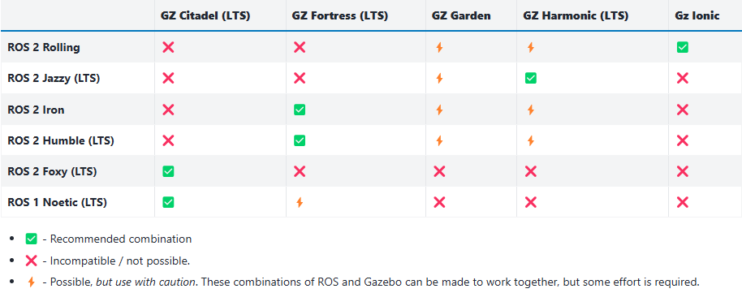

# Install Gazebo

The official documentation for installing Gazebo can be found [here](https://gazebosim.org/docs/latest/getstarted/).
Here, a brief overview of the installation process is provided.

ROS users that intend to use Gazebo should not necessarily install the latest version of Gazebo, but rather the version that is compatible with their ROS distribution.
The best user experience is achieved when the LTS (Long-Term Support) versions of ROS and Gazebo are used and they are compatible with each other.
Below is a table that shows the compatibility between ROS and Gazebo versions:



In the case of ROS 2 Iron, the recommended version of Gazebo is Gazebo Fortress.

The easiest way to install Gazebo is to use binary packages, which can be found in online repositories.
Before installing Gazebo, be sure that some necessary tools, namely `lsb-release` and `gnupg`, are installed in your Ubuntu system:

```bash
sudo apt update
sudo apt install lsb-release gnupg
```

To install Gazebo Fortress, add the Gazebo repository to the system, so that the system can find the Gazebo packages.
First, download the Gazebo repository GPG key:

```bash
sudo curl https://packages.osrfoundation.org/gazebo.gpg --output /usr/share/keyrings/pkgs-osrf-archive-keyring.gpg
```

Then, add the Gazebo repository to the list of repositories:

```bash
echo "deb [arch=$(dpkg --print-architecture) signed-by=/usr/share/keyrings/pkgs-osrf-archive-keyring.gpg] http://packages.osrfoundation.org/gazebo/ubuntu-stable $(lsb_release -cs) main" | sudo tee /etc/apt/sources.list.d/gazebo-stable.list > /dev/null
```

The latter command adds a new file called `gazebo-stable.list` to the `/etc/apt/sources.list.d/` directory. This file contains the URL of the Gazebo repository, which is augmented with the codename of the Ubuntu distribution and the location of the GPG key (needed to verify the authenticity of the packages downloaded from the new repository).

After adding the Gazebo repository, update the package list and install Gazebo Fortress (the package name is `ignition-fortress`):

```bash
sudo apt update
sudo apt install ignition-fortress
```

To check if Gazebo Fortress was installed correctly, you can run the following command:

```bash
ign help
```

If the installation was successful, you will see a list of available commands for the Ignition tools.