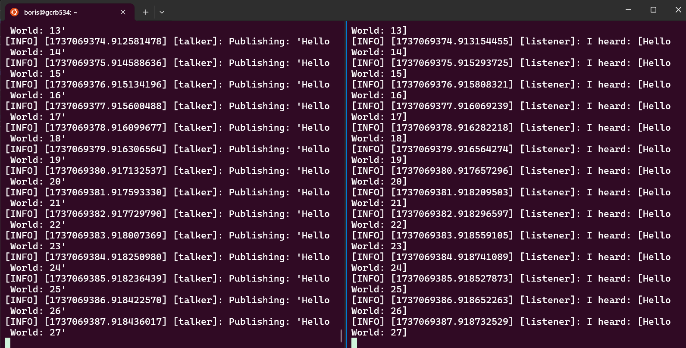

# Installing ROS in Ubuntu 22.04 (Native, Virtual Machine, or WSL)

This guide provides instructions on how to install ROS 2 (version: Iron Irwini) on Ubuntu 22.04.
The installation instructions are easily adaptable to other versions of ROS 2 and Ubuntu.
However, the Iron Irwini version of ROS 2 is compatible with Ubuntu 22.04 only.

The guide is based on the official ROS 2 installation instructions available [here](https://docs.ros.org/en/iron/Installation.html).

## WSL

If you are using Windows, the simplest solution is to install ROS 2 on the Windows Subsystem for Linux (WSL).
WSL is a compatibility layer for running Linux binary executables natively on Windows.
To install and set up WSL, follow the instructions provided by Microsoft [here](https://learn.microsoft.com/en-us/windows/wsl/install).

To install a specific version of Ubuntu on WSL, you can list the available versions using the following command:

```bash
wsl --list --online
```

To install a specific version of Ubuntu, run the following command:

```bash
wsl --install -d <Distro>
```

Replace `<Distro>` with the name listed in the output of the previous command.
For example, to install Ubuntu 22.04, run the following command:

```bash
wsl --install -d Ubuntu-22.04
```

## Locale

Locale is a set of parameters that defines the user's language, region, and character encoding. It is important to set the locale correctly before installing ROS.

```bash
sudo apt update
sudo apt install locales
sudo locale-gen en_US en_US.UTF-8
sudo update-locale LC_ALL=en_US.UTF-8 LANG=en_US.UTF-8
export LANG=en_US.UTF-8
```

Verify the locale settings by running the following command:

```bash
locale
```

This is the expected output:

```bash
LANG=en_US.UTF-8
LANGUAGE=
LC_CTYPE="en_US.UTF-8"
LC_NUMERIC="en_US.UTF-8"
LC_TIME="en_US.UTF-8"
LC_COLLATE="en_US.UTF-8"
LC_MONETARY="en_US.UTF-8"
LC_MESSAGES="en_US.UTF-8"
LC_PAPER="en_US.UTF-8"
LC_NAME="en_US.UTF-8"
LC_ADDRESS="en_US.UTF-8"
LC_TELEPHONE="en_US.UTF-8"
LC_MEASUREMENT="en_US.UTF-8"
LC_IDENTIFICATION="en_US.UTF-8"
LC_ALL=
```

## Enable Universe APT Repository

ROS packages are available in the Universe repository. Therefore, it is important to enable the `apt` command to access to the Universe repository before installing ROS.
`software-properties-common` is the required package to manage software repositories.

```bash
sudo apt install software-properties-common 
sudo add-apt-repository universe
```

## Install CURL

CURL is a command-line tool that allows you to transfer data from or to a server. It is required to download the ROS installation script.

```bash
sudo apt update
sudo apt install curl -y
```

## Download ROS key

ROS packages are signed using GPG keys. This key is used to verify the authenticity of the packages, so that you can be sure that the packages are not modified by a third party.
Download the ROS key and save it in the `/usr/share/keyrings/` directory using the following command:

```bash
sudo curl -sSL https://raw.githubusercontent.com/ros/rosdistro/master/ros.key -o /usr/share/keyrings/ros-archive-keyring.gpg
```

## Add ROS repository

Add the ROS repository to the `apt` sources list and specify where to find the ROS key using the following command:

```bash
echo "deb [arch=$(dpkg --print-architecture) signed-by=/usr/share/keyrings/ros-archive-keyring.gpg] http://packages.ros.org/ros2/ubuntu $(. /etc/os-release && echo $UBUNTU_CODENAME) main" | sudo tee /etc/apt/sources.list.d/ros2.list > /dev/null
```

## Install ROS 2

Before installing ROS 2, update the `apt` package list using the following command:

```bash
sudo apt update
```

ROS 2 packages are built on frequently updated Ubuntu systems. It is always recommended that you ensure your system is up to date before installing new packages. To upgrade the existing packages to the latest version, run the following command:

```bash
sudo apt upgrade -y
```

Two versions of ROS 2 are available: the desktop version and the base version. 
The desktop version includes the ROS 2 core packages, demos, tutorials, and tools that are commonly used in ROS 2 development. 
The base version includes only the essential packages required to run ROS 2.

### ROS 2 Desktop Install (Recommended)

To install the desktop version of ROS 2, run the following command:

```bash
sudo apt install ros-iron-desktop
```

### ROS 2 Base Install (Only Essential Packages)

If you choose not to install the desktop version, you can install the base version of ROS 2.
To install the base version of ROS 2, run the following command:

```bash
sudo apt install ros-iron-base
```

## Verify the Installation

To verify the installation, start by setting up the ROS 2 environment.

### Environment Setup

The ROS 2 environment must be set up in every new terminal window before using ROS 2 commands. You can set up the ROS 2 environment by using the following command:

```bash
# Replace ".bash" with your shell if you're not using bash
# Possible values are: setup.bash, setup.sh, setup.zsh
source /opt/ros/iron/setup.bash
```

The `sh` extension is used for the Bourne shell, which is the original Linux shell and is highly portable across different Unix-like systems (e.g., Linux, macOS).
The `bash` extends the capabilities of the Bourne shell and is the default shell on most Linux distributions (including Ubuntu). It is also compatible with macOS.
The `zsh` aims to be a superset of the `bash` shell and is currently the default shell on macOS.

The `source` command is used to read and execute the content of a file in the current shell environment. The `/opt/ros/iron/setup.bash` file contains the ROS 2 environment setup.

If you don't want to run the `source` command every time you open a new terminal window, you can add it to the shell configuration file. For example, to add it to the end of the `.bashrc` file, run the following command:

```bash
echo "source /opt/ros/iron/setup.bash" >> ~/.bashrc
```

Note that the `>>` operator is used to append the `source` command to the end of the `.bashrc` file. If you use the `>` operator, it will overwrite the content of the file, which is not what you want in this case as the `.bashrc` file contains other important configurations that you don't want to lose.

Now, if you close the terminal window and open a new one, the new terminal window will actually read the `.bashrc` file and set up the ROS 2 environment automatically.

### Talker and Listener Example

To verify the installation, run the talker and listener example.
The talker and listener are two simple ROS 2 nodes that send and receive messages, respectively.
You will need to open two terminal windows to run the talker and listener nodes.

In the first terminal window, run the following command to start the talker node:

```bash
# Set up the ROS 2 environment (if your .bashrc file is not updated)
source /opt/ros/iron/setup.bash 

ros2 run demo_nodes_cpp talker
```

In the second terminal window, run the following command to start the listener node:

```bash
# Set up the ROS 2 environment (if your .bashrc file is not updated)
source /opt/ros/iron/setup.bash

ros2 run demo_nodes_cpp listener
```

If the installation is successful, you will see the talker node publishing (i.e., sending) messages (e.g., `Hello World 0`) and the listener node hearing (i.e., receiving) those messages.



To stop the nodes, press `Ctrl + C` in each terminal window.
