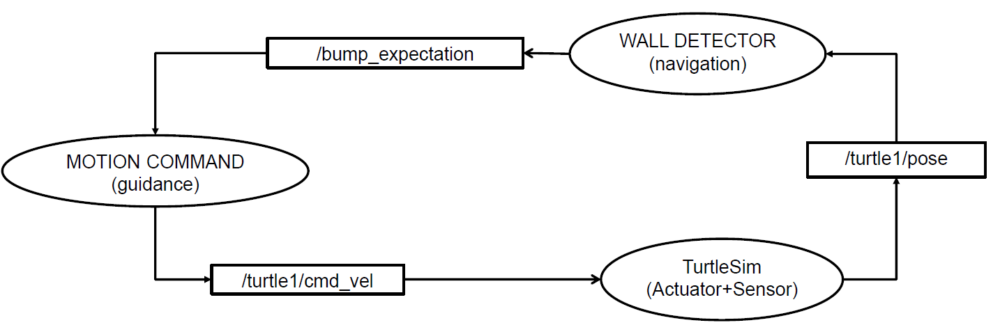

# Closed Loop Turtle

This document provides an overview of the closed loop turtle example.

## Overview

The closed loop turtle example demonstrates how to create a closed-loop system using a turtle that moves around in a squared domain without hitting the walls.

The turtle moves forward until the navigation system detects that it is about to hit a wall. At that point, the turtle stops, rotates, and continues moving forward.

## Nodes

The closed loop turtle example consists of the following nodes:



The graph is composed of the following nodes:

- `turtlesim`: This node is the `turtlesim` simulator, which provides information about the current state of the turtle.
- `wall_detector`: This node estimates the distance between the turtle and the closest wall
- `motion_command`: This node computes the guidance signal based on the estimated current and future states and the detected wall distance.

In this scenario, every node is both a publisher and a subscriber. The `wall_detector` node subscribes to the `/turtle1/pose` topic, which provides the current position of the turtle, computes the distance from the closest wall, and publishes whether the turtle is too close to the wall to the `/bump_expectation` topic.
The `motion_command` node subscribes to the `/bump_expectation` topic, computes the guidance signal, and publishes it to the `/turtle1/cmd_vel` topic.
The `turtlesim` node subscribes to the `/turtle1/cmd_vel` topic, moves the turtle accordingly, and publishes the new position of the turtle to the `/turtle1/pose` topic, closing the loop.

## Packages

The closed loop turtle example relies on the following packages:

- `closed_loop`: This is a custom package where the nodes `wall_detector` and `motion_command` are defined.
- `turtlesim`: This package provides the `turtlesim` simulator.

## Workspace

A new workspace named `closed_loop_turtle` is created to contain the `closed_loop` package.
The `turtlesim` package is included as a dependency in the `package.xml` file of the `closed_loop` package.

## Create the `closed_loop` Package

To create the `closed_loop` package, move into the `src` directory of the workspace and run the following command:

```bash
ros2 pkg create --build-type ament_python --license Apache-2.0 --node-name hello_cl closed_loop
```

To check that the package has been created successfully, move into the `closed_loop` root directory and run the following commands:

```bash
colcon build --symlink-install
source install/setup.bash
ros2 run closed_loop hello_cl
```

### Create the `wall_detector` Node

Starting from a publisher template, create the `wall_detector.py` file inside the `closed_loop` package with the following content.
First, import the necessary modules:

```python
import rclpy
from rclpy.node import Node

from std_msgs.msg import Int32
from turtlesim.msg import Pose  # Pose: x, y, theta
```

Then, define the `WallDetector` class that inherits from the `Node` class:

```python
class WallDetector(Node):

    def __init__(self):
        # Initialize the base class
        super().__init__('wall_detector')

        # Create a subscriber to the pose of the turtle
        self.subscription = self.create_subscription(
            Pose,                       # Message type
            '/turtle1/pose',            # Topic
            self.turtle_pose_callback,  # Callback function
            10)                         # QoS profile (history depth)

        # Create a publisher to publish information about hitting the wall
        # This will be an integer (0 or 1) that indicates whether the turtle
        # is too close to the wall
        self.publisher_ = self.create_publisher(
            Int32, 
            '/bump_expectation',
            10)
        publisher_timer_period = 1 # seconds
        self.publisher_timer = self.create_timer(
            publisher_timer_period, 
            self.warning_callback)
        
        # Initialize the wall_flag to 0
        self.wall_flag = 0

    # ...
```

The constructor initializes the node with the name `wall_detector` and creates a subscriber to the `/turtle1/pose` topic, which provides information about the turtle's pose. The callback function `turtle_pose_callback` is called whenever a new message is received on the topic.
The wall detector node also creates a publisher to publish information about hitting the wall. The published message is an integer (0 or 1) that indicates whether the turtle is too close to the wall. The `warning_callback` function is called periodically to publish the wall flag.

Next, define the `turtle_pose_callback` function:

```python
class WallDetector(Node):
    # ...

    def turtle_pose_callback(self, msg):
        # The pose msg contains three numbers (the x, y, and theta of the 
        # turtle). This can be verified by running the following command:
        # ros2 interface show turtlesim/msg/Pose
        self.turtle_x = msg.x
        self.turtle_y = msg.y
        # turtle_theta = msg.theta

        # Log the pose of the turtle (debug level only, change to info if 
        # needed)
        self.get_logger().debug('Turtle pose: x=%f, y=%f' % \
                               (self.turtle_x, self.turtle_y))

        # Define the boundaries of the domain
        x_min = 2
        x_max = 9
        y_min = x_min
        y_max = x_max

        # Check if the turtle is too close to the wall
        # The domain boundaries (i.e., the walls) are [0, 11]x[0, 11]. If the
        # turtle approaches too much the walls, we will issue a warning, which
        # corresponds to a 1. Otherwise, we will issue a 0, indicating that the
        # turtle is not too close to the wall.
        # The margin is conservative, as the turtle is considered too close to
        # the wall if it goes outside the domain [x_min, x_max]x[y_min, y_max]
        # with x_min = y_min > 0 and x_max = y_max < 11.
        if self.turtle_x < x_min or self.turtle_x > x_max or \
            self.turtle_y < y_min or self.turtle_y > y_max:
            # Too close to the walls
            self.wall_flag = 1

            # Log a message to indicate that the turtle is too close to the wall
            self.get_logger().debug('Turtle is too close to the wall')
        else:
            # Not too close to the walls
            self.wall_flag = 0

            # Log a message to indicate that the turtle is not too close to the 
            # wall
            self.get_logger().debug('Turtle is not too close to the wall')
    # ...
```

The `turtle_pose_callback` function extracts the turtle's x and y coordinates from the received message and checks if the turtle is too close to the wall. If the turtle is too close to the wall, the `wall_flag` is set to 1; otherwise, it is set to 0.
In this implementation, the turtle is considered too close to the wall if it goes outside the domain `[x_min, x_max]x[y_min, y_max]`.

Finally, define the `warning_callback` function:

```python
class WallDetector(Node):
    # ...
    def warning_callback(self):

        # Create a message to publish
        msg = Int32()

        # Customize the message based on the wall_flag
        msg.data = self.wall_flag

        # Publish the message
        self.publisher_.publish(msg)
```

The `warning_callback` function creates an `Int32` message and sets its data field to the `wall_flag` value. The message is then published on the `/bump_expectation` topic.

Finally, add the following lines to the `main` function to create an instance of the `WallDetector` class and start the node:

```python
def main(args=None):
    rclpy.init(args=args)

    wall_detector = WallDetector()

    rclpy.spin(wall_detector)

    # Destroy the node explicitly
    # (optional - otherwise it will be done automatically
    # when the garbage collector destroys the node object)
    wall_detector.destroy_node()
    rclpy.shutdown()

if __name__ == '__main__':
    main()
```

### Create the `motion_command` Node

Similarly, create the `motion_command.py` file inside the `closed_loop` package with the following content.
First, import the necessary modules:

```python
import rclpy
from rclpy.node import Node

from geometry_msgs.msg import Twist
from std_msgs.msg import Int32
```

Then, define the `MotionCommand` class that inherits from the `Node` class:

```python
class MotionCommand(Node):

    def __init__(self):
        # Initialize the base class
        super().__init__('motion_command')

        # Create a subscriber to the bump_expectation topic
        self.subscription = self.create_subscription(
            Int32,                           # Message type
            '/bump_expectation',             # Topic
            self.bump_expectation_callback,  # Callback function
            10)                              # QoS profile (history depth)
        
        # Create a publisher to publish the command (Go Straight or Twist) to 
        # the turtle
        self.publisher_ = self.create_publisher(
            Twist,                  # Message type 
            '/turtle1/cmd_vel',     # Topic
            10)                     # QoS profile (history depth)
        publisher_timer_period = 1 # seconds
        self.publisher_timer = self.create_timer(
            publisher_timer_period, 
            self.command_callback)  # Create timer for the publishers
        
        # Initialize the wall_flag to 0
        self.wall_flag = 0

        # Linear velocity
        self.linear_velocity_straight = 1.0   # when going straight
        self.linear_velocity_turn = 0.        # when turning

        # Angular velocity
        deg2rad = 3.14 / 180.0
        self.angular_velocity_straight = 0.0        # when going straight
        self.angular_velocity_turn = 50.0 * deg2rad # when turning

    # ...
```

The constructor initializes the node with the name `motion_command` and creates a subscriber to the `/bump_expectation` topic, which provides information about whether the turtle is too close to the wall.
The callback function `bump_expectation_callback` is called whenever a new message is received on the topic.
The motion command node also creates a publisher to publish the command to the turtle.
The published message is a `Twist` message that contains the linear and angular velocities (x, y, z components) of the turtle.
The `command_callback` function is called periodically to publish the command.

Next, define the `bump_expectation_callback` function:

```python
class MotionCommand(Node):
    # ...
    def bump_expectation_callback(self, msg):
        # Listen for the bump_expectation topic. If the turtle is too close to
        # the wall, it will receive a 1. If it is not too close to the wall, it
        # will receive a 0.

        # Previous wall_flag
        previous_wall_flag = self.wall_flag

        # New wall_flag
        self.wall_flag = msg.data

        # Check if the wall_flag has changed
        if previous_wall_flag != self.wall_flag:
            if self.wall_flag == 1:
                self.get_logger().info('Getting too close to the wall')
            else:
                self.get_logger().info('Not too close to the wall anymore')
    # ...
```

The `bump_expectation_callback` function listens for the `/bump_expectation` topic to update the `wall_flag` value.
If the turtle is too close to the wall, it receives a 1; otherwise, it receives a 0.
The function logs a message when the `wall_flag` changes.

Finally, define the `command_callback` function:

```python
class MotionCommand(Node):
    # ...
    def command_callback(self):
        # Initialize the message
        msg = Twist()

        # Customize the message based on the wall_flag
        if self.wall_flag == 1: # Too close to the wall
            # Turn
            msg.linear.x = self.linear_velocity_turn
            msg.angular.z = self.angular_velocity_turn

            # Increase linear velocity to avoid getting stuck (i.e., to avoid
            # going in circles in a zone that is too close to the wall)
            self.linear_velocity_turn += 0.1
        else:
            # Go straight
            msg.linear.x = self.linear_velocity_straight
            msg.angular.z = self.angular_velocity_straight

            # Reset linear velocity for the next time the turtle gets too close
            # to the wall
            self.linear_velocity_turn = 0.0

        # Publish the message
        self.publisher_.publish(msg)
```

The `command_callback` function creates a `Twist` message and sets the linear and angular velocities based on the `wall_flag` value.
If the turtle is too close to the wall, the turtle turns; otherwise, it moves straight.
To avoid getting stuck in a loop in the zone that is too close to the wall, the linear velocity during turning is zero at the beginning and increases by 0.1 at each iteration.

Finally, the `main` function creates an instance of the `MotionCommand` class and starts the node:

```python
def main(args=None):
    rclpy.init(args=args)

    motion_command = MotionCommand()

    rclpy.spin(motion_command)

    # Destroy the node explicitly
    # (optional - otherwise it will be done automatically
    # when the garbage collector destroys the node object)
    motion_command.destroy_node()
    rclpy.shutdown()

if __name__ == '__main__':
    main()
```

### Add Entry Points to the `setup.py` File

To make the nodes executable, add the following entry points to the `setup.py` file of the `closed_loop` package:

```python
entry_points={
    'console_scripts': [
        'wall_detector = closed_loop.wall_detector:main',
        'motion_command = closed_loop.motion_command:main',
    ],
},
```

### Add the `turtlesim` Package as a Dependency in the `package.xml` File

To include the `turtlesim` package as a dependency in the `package.xml` file of the `closed_loop` package, add the following line:

```xml
<exec_depend>turtlesim</exec_depend>
```

### Create the Launch File

Create a launch file named `launch.py` inside the `closed_loop` package `launch` directory with the following content:

```python
from launch import LaunchDescription
from launch_ros.actions import Node

def generate_launch_description():
    return LaunchDescription([
        Node(
            package='closed_loop',        # package name
            executable='motion_command',  # executable name
            name='motion_command'         # node name
        ),
        Node(
            package='closed_loop',
            executable='wall_detector',
            name='wall_detector'
        ),
        Node(
            package='turtlesim',
            executable='turtlesim_node',
            name='turtle1'
        ),
    ])
```

The launch file starts the `motion_command`, `wall_detector`, and `turtlesim` nodes.
Note that the `turtlesim` node is given the name `turtle1` as the topic names `/turtle1/pose` and `/turtle1/cmd_vel` are hardcoded in the `wall_detector` and `motion_command` nodes, respectively.

### Update `setup.py` with the Launch File

To include the launch file in the package, add the following lines to the `setup.py` file of the `closed_loop` package:

```python
import os
from glob import glob
# ...

setup(
    # ...
    data_files=[
        (os.path.join('share', package_name, 'launch'), 
            glob(os.path.join('launch', '*launch.[pxy][yma]*'))),
    ],
)
```

### Build and Run the Nodes

First, check for rosdeps:

```bash
cd <path/to>/closed_loop_turtle
rosdep install -i --from-path src --rosdistro iron -y
```

Then, build the workspace using `colcon`:

```bash
colcon build --symlink-install
```

Finally, source the workspace and launch the nodes:

```bash
source install/setup.bash
ros2 launch closed_loop launch.py
```
